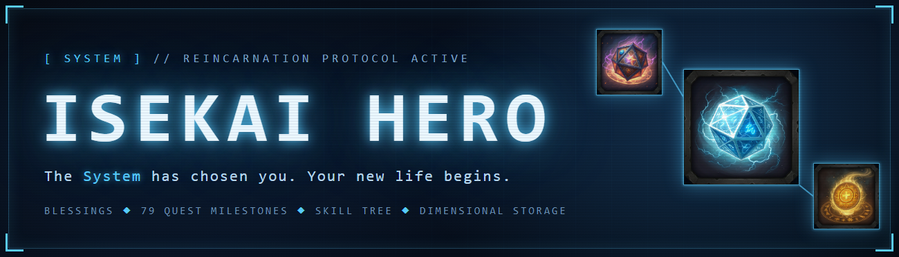
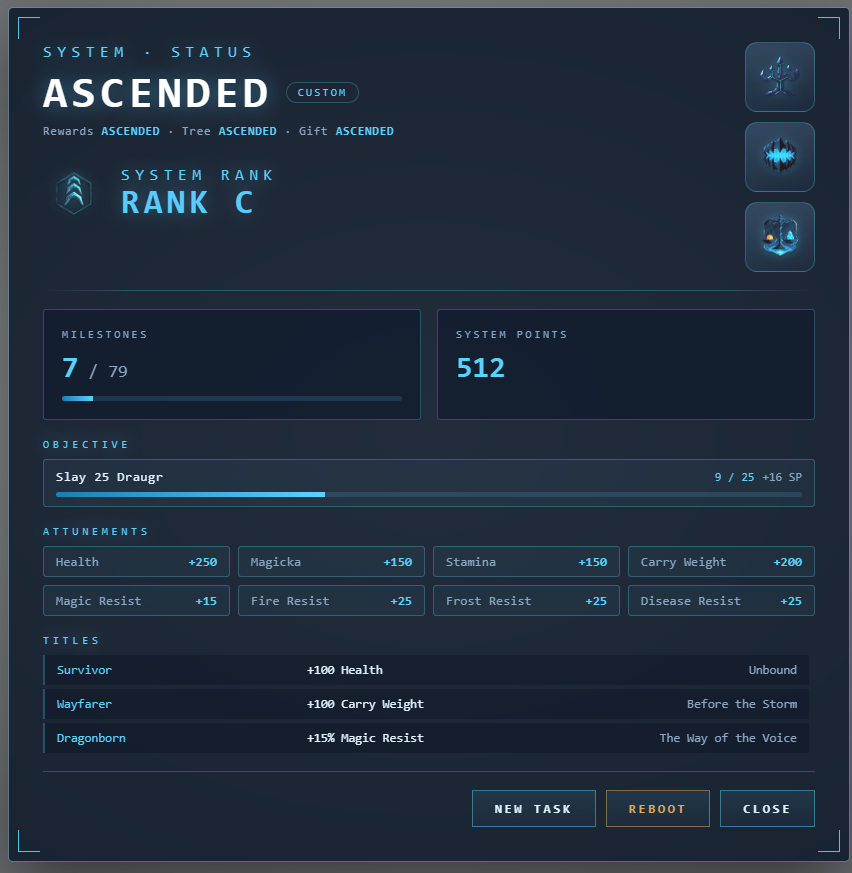
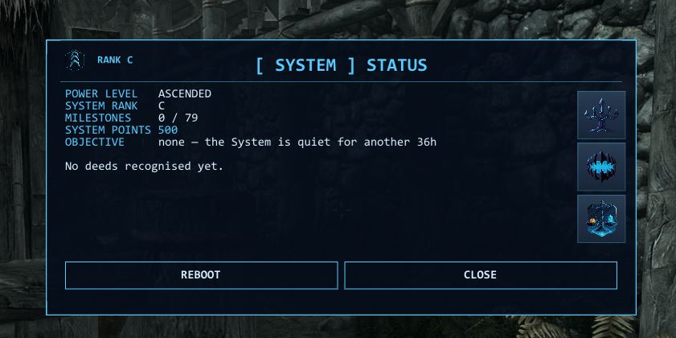
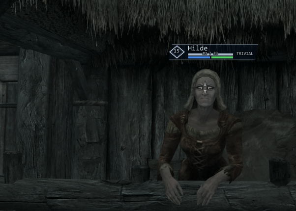

<div align="center">



<br>


**An Isekai / "reincarnated hero" system for Skyrim Special Edition** — a native
**SKSE C++ plugin** built on [CommonLibSSE-NG](https://github.com/alandtse/CommonLibSSE-NG),
with its own ImGui UI drawn straight into the game's D3D11 swap chain.

[**Nexus page**](https://www.nexusmods.com/skyrimspecialedition/mods/185548) ·
[Changelog](CHANGELOG.md) ·
[VR status](docs/VR.md) ·
[Test plan](docs/MANUAL_TESTS.md)

</div>

> ### ⚙️ Skyrim updated. **0.9.0 runs on the new runtime.**
>
> Steam's update took Skyrim to **1.7.104**, and SKSE plugins built against the old
> library stopped loading with it — that library identifies a runtime by its minor
> version, so `1.7` was read as plain SE, and its address-library reader only knows
> database formats 1 and 2 while 1.7.99 and later ship format 5.
>
> **0.9.0 is built against [CommonLibSSE-NG](https://github.com/alandtse/CommonLibSSE-NG)
> 7.5.4 and loads on 1.7.104 again.** Nothing was dropped to get there: the same single
> DLL still serves **SE, AE and VR**, and older runtimes — 1.6.1170 included — are
> unaffected. Update your **Address Library** along with the game; that is the one
> requirement 1.7 changes.
>
> Staying on an older runtime? Nothing to do — install 0.9.0 like any other version.

---

## What it looks like

<table>
<tr>
<td width="52%" valign="top">

<sub><b>The optional PrismaUI patch</b> — the whole UI rendered as an HTML/CSS view: tier,
System Rank, milestones, the running objective, attunements and earned titles.</sub>
</td>
<td width="48%" valign="top">

<sub><b>The built-in ImGui panel</b> — no foreign dependency, ships with the base mod.</sub>
<br><br>

<sub><b>Threat labels</b> — the System's read on anything you aim at or that fights you.</sub>
</td>
</tr>
</table>

---

## Features

### Reincarnation, and the blessing you choose

Fires the first time the player is actually in the world — vanilla starts, `coc`,
Alternate Start, Skyrim Unbound all work. A paced `[ SYSTEM ]` boot sequence leads into
the blessing choice.

**Three blessings**, each of which keeps mattering for the whole playthrough:

| | NORMAL | HERO | ASCENDED |
|---|---|---|---|
| Skills | — | 50 | 100 |
| Health / Magicka / Stamina, raised *to* | — | 180 | 600 |
| Perk points | — | 10 | 255 (engine max) |
| Gold / Dragon souls / System Points | — | 2k / 3 / 5 | 25k / 20 / 10 |
| Reward scale on everything below | ×1 | ×2 | ×4 |

**A blessing grants a body, never a character level.** Skyrim's levelled lists key off the
character level, so the old level-150 grant dragged every scaling enemy to its ceiling the
moment you reincarnated — which is why the world felt impossible and then trivial. Your
skills, attributes and perks make you stronger; the world stays where it is. Every number
in that table is an ini setting, and all eight are in the MCM.

<sub>Raised *to* a target, never past it and never twice — so a DORMANT character awakening
at level 80 receives only what they are missing.</sub>

<details>
<summary><b>Full, Shattered, Dormant, Custom — and Reboot</b></summary>

<br>

HERO and ASCENDED additionally choose **Full** or **Shattered**: Full grants the flat
start above; **Shattered** keeps only the tier's reward scale and the deeper skill tree,
starting you at the NORMAL floor — the higher ceiling, earned.

A fourth choice, **Dormant**, does not pick a tier at all: you start at NORMAL and the
blessing wakes on its own — HERO at level 25, ASCENDED at level 80 (configurable,
`[Dormant]` in the ini). Nothing arrives early, nothing stays sealed for good. It is
orthogonal to the question above, so Dormant + Shattered grows only the System's reach
and never hands over a grant.

And a fifth, **Custom**, unbundles the tier: you set its three pieces independently — the
**starting gift** (flat skills/level/gold), the **reward pace** (×1/×2/×4) and the
**skill-tree depth** — each NORMAL/HERO/ASCENDED. So "the whole tree open, but a normal
start and normal rewards" is a valid build; it self-balances, because you still buy every
node with System Points earned at your chosen pace.

Changed your mind later? The System status panel has a **Reboot** button (with a confirm)
that re-opens this whole blessing choice on an existing character — keeping your
milestones, skill tree and System Points. *(Stats a previous Full blessing already granted
stay; only a new game truly starts from zero.)*

The status panel also shows a derived **System Rank** (E through S) next to your tier — a
single readout of milestones earned, character level and System Points invested in the
tree, the "how far along am I" number every isekai protagonist gets.

</details>

### 79 quest milestones

Main quest, Companions, College, Thieves Guild, Dark Brotherhood, Civil War beats,
Dawnguard, Dragonborn. Completing one plays a level-up flourish (rings, title punch,
custom sound) and pays out a passive stat bonus, System Points, and on the big beats
dragon souls. Already-completed quests are recognised retroactively on load.

**Passives are real abilities.** All milestone bonuses aggregate into eight `System:`
abilities visible under Active Effects — recomputed from scratch on every load, so they
can never double-apply.

### The System Skill Tree

`RShift+S` → crystal icon. A hub and three named, visually framed branches — **MIGHT**,
**SHADOW**, **ARCANA** — plus a **MASTERY** rail, all paid with **System Points**. Every
node shows its name, and the tree's landmarks (the hub, the World Tree capstone, the
Omniscience gifts) are drawn larger than the leaves.

<details>
<summary><b>Knowledge unlocks, repeatable nodes, tier gating and respec</b></summary>

<br>

Four knowledge unlocks span *every loaded plugin* via semantic filters:

- all shouts + words of power ("has a description", deduplicated by name)
- all enchantments ("referenced as a base enchantment")
- all ingredient effects
- all spells ("has a spell tome")

Plus **repeatable** nodes with no lock-out: **Perk Synthesis** (1 System Point → 5 perk
points, uncapped) and eight **mastery** utility stats in their own scrolling rail —
**Fleet of Foot** (move speed), **Beast of Burden** (carry weight), **Enduring Vigor**
(Health/Magicka/Stamina), **Storm Ward** (Shock Resist), **Warded Mind** (Magic Resist),
**Arcane Absorption** (Spell Absorption), **Iron Skin** (Armor Rating) and **Rapid
Recovery** (H/M/S regen). Each climbs 10 ranks across 5 named tiers (Novice through
Grandmaster, price rising per tier), with a level-up flourish on reaching Grandmaster — a
real, celebrated ceiling instead of an open-ended grind.

The tree is **gated by rebirth tier** (`Node::minPower`): NORMAL walks the self-made
stat/utility half, HERO additionally unlocks the four Omniscience gifts, ASCENDED
additionally unlocks the World Tree capstone. Sealed nodes render greyed with a "requires
HERO/ASCENDED rebirth" hint — or, on a dormant blessing, the level they awaken at (or
hidden entirely — see `IsekaiHero.ini`) — one shared graph, one source of truth, no
duplicate tables.

A **Respec** button refunds the points spent on stat nodes and reverts their effects; the
knowledge unlocks and Perk Synthesis are excluded, since neither can honestly be taken
back.

</details>

### Threat labels

The System's read on an enemy — the "Observation"/"Appraisal" move every isekai
protagonist gets — is not a node. It is simply **on**: a colour-coded
TRIVIAL/MANAGEABLE/DANGEROUS/LETHAL floating over what you are aiming at and over anything
fighting you, shrinking and dimming with distance. `F10` switches it off and on, and
`IsekaiHero.ini` decides who gets a label.

> *In VR the labels are billboards in the world rather than an overlay, and they ship
> **off** — see the VR box under Requirements.*

### Dimensional Storage

One chest inventory reachable from anywhere via the System panel. Crafting stations **read
and consume its contents in place** — the material count and the recipe both see the chest
without anything being shuttled around.

<details>
<summary><b>How it survives a full overhaul stack</b></summary>

<br>

Recipes a mod hides behind "do you carry this?" still appear (a single unit of each stored
material is lent while you craft, then returned), and other mods' pre-craft prompts — an
enchanter's "empower with a flawless gem?" — see the stored gems too. Stock is drawn from
what recipes require, so DLC materials come along (chitin plate, netch leather, corkbulb
root).

It **starts empty for every blessing** — you stock it from the System Shop's material
packs, so what it holds is what you chose to spend System Points on. A **storage codex**
(granted on reincarnation) is a table-free physical shortcut: use it from the inventory and
the chest opens directly, no System panel needed — and it never runs out.

</details>

### System Quests

The System hands you a kill objective — "Slay 25 Draugr" — announces it, counts your kills
top-centre as they happen, and pays System Points when it is done. Then it goes quiet for a
day and offers the next one on its own; it is never waiting for you to open a menu, and
never sends a low-level character after dragons. Targets are matched by actor *keyword*, so
creatures added by other mods count too. No quest markers and no busywork: it ticks over in
the background of however you were already playing, and it is what keeps System Points
coming in once the 79 milestones run out.

### Kill bounties and professions

Beside the objectives, the System simply watches. Every kill is tallied against the quarry
types it matches — the same keywords the objectives use — and each time a type crosses
another 50 it pays out. Harvesting, smelting, tanning, smithing, alchemy and enchanting
count as one track: every 25 of them pays a System Point. Neither needs an objective
standing, and both thresholds are settings. A character who never fights and only crafts
still earns.

### System Shop

A third button beside Skill Tree and Storage in the status panel, opening its own screen of
item cards. Spend System Points on **material packs** (smithing, alchemy, soul gems — each
in a small and a large size) or on gold, all delivered straight into the Dimensional
Storage. This is how the storage gets filled at all, and it means points keep mattering
long after the skill tree is bought out.

### Custom UI and sound

Solo-Levelling-inspired panels (glow frames, corner brackets, typewriter reveal, monospace
terminal font), custom SFX routed through the game's audio system, icon buttons, ESC
handled properly.

An optional **[PrismaUI](https://www.nexusmods.com/skyrimspecialedition/mods/148718)
patch** renders the **whole UI** — the tree, the System dialog panels and the level-up
flourish — as an HTML/CSS view instead of ImGui. Auto-detected at load, with a safe ImGui
fallback whenever the patch or the framework is absent. The base mod depends on neither.
See `prisma-patch/`, `src/UI/Prisma.cpp` and `package-prisma-patch.ps1`.

An optional **MCM** component puts 28 of the 32 ini settings into SkyUI, each row carrying
the explanation the ini gives it. It needs [SkyUI](https://www.nexusmods.com/skyrimspecialedition/mods/12604)
and [MCM Helper](https://www.nexusmods.com/skyrimspecialedition/mods/53000); the plugin
itself uses no MCM Helper API — the menu writes a plain ini that `Config` layers over the
shipped one, so a key the menu never mentions falls through rather than resetting.

### Optional SkyrimNet integration *(experimental, untested)*

When [SkyrimNet](https://github.com/MinLL/SkyrimNet-GamePlugin) (AI-driven NPCs) is
installed, the mod pushes the player's System status to it — the reincarnation and tier,
and each milestone earned — as persistent world-knowledge, so AI NPCs can react to the
isekai premise. One-way and soft-detected: no build- or load-time dependency, does nothing
without SkyrimNet, and can be switched off in `IsekaiHero.ini`.

> **Not yet verified in a running game with SkyrimNet.** It has no effect at all unless
> SkyrimNet is present, so it is safe for everyone else. See `src/SkyrimNet.cpp`.

---

## Requirements

| | |
|---|---|
| **Game** | Skyrim SE / AE / VR — one DLL covers all three, up to and including runtime **1.7.104** |
| **Required** | [SKSE64](https://skse.silverlock.org/) |
| **Required** | [Address Library for SKSE Plugins](https://www.nexusmods.com/skyrimspecialedition/mods/32444) — on 1.7.x this has to be a current build; in VR, the VR Address Library for SKSEVR |
| **Optional** | [PrismaUI](https://www.nexusmods.com/skyrimspecialedition/mods/148718) — for the HTML/CSS UI patch |
| **Optional** | [SkyUI](https://www.nexusmods.com/skyrimspecialedition/mods/12604) + [MCM Helper](https://www.nexusmods.com/skyrimspecialedition/mods/53000) — for the MCM component |
| **Optional** | [SkyrimNet](https://github.com/MinLL/SkyrimNet-GamePlugin) — for AI NPC awareness |

<details>
<summary><b>Skyrim VR (experimental)</b></summary>

<br>

The plugin is built for all three runtimes at once (CommonLibSSE-NG) and loads under
**SKSEVR** with the **VR Address Library for SKSEVR** — same archive, no separate VR build.
The mod's logic (blessings, milestones, passives, storage, crafting) is runtime-neutral.

The built-in **ImGui overlay is disabled in VR** (it hooks the desktop swap chain, which
crashes on the VR renderer and would never appear in the headset anyway), so in VR **all UI
goes through the PrismaUI patch** — which needs PrismaUI's **1.5.0 VR build** (the stable
1.4.x has no VR). Without it, the System menu cannot be shown in VR and the mod holds off
the reincarnation prompt rather than stranding the character. A VR player has confirmed
the menus work this way.

The separate **in-headset layer** — threat labels as world billboards, notifications on a
head-locked plane, and a controller chord — draws through
[ImGui VR Helper](https://www.nexusmods.com/skyrimspecialedition/mods/149180) and **ships
off** (`VRInHeadsetLayer = 0`). The same player reported that with the helper installed the
game exits to the desktop as the mods finish loading, every time, without writing a crash
log. The cause is not known and there is no VR install here to find it on, so it is off
until it is. Turn it on and you are helping find it — see
[#35](https://github.com/dstNr/isekai-hero-skyrim/issues/35).

Still community-testing; see [docs/VR.md](docs/VR.md) for status, requirements and the test
checklist.

</details>

---

## Installation

Install `dist/IsekaiHero-v*.7z` with your mod manager and activate `IsekaiHero.esp`. The
archive is a **FOMOD**: it asks which interface you want (with the MCM offered beside it),
whether the System boots itself or waits for your hotkey, and whether you want the threat
readings. Everything it sets is one line in `IsekaiHero.ini` and can be changed afterwards. The plugin is **ESL-flagged** — it takes no load order slot, overrides no
vanilla records, and its position in the load order does not matter.

> **Safe to install mid-playthrough.** On an existing save the System boots on the next
> load, already-completed milestone quests are rewarded retroactively, and blessings only
> ever raise stats — never demote an established character.

In-game: **RShift + S** (remappable in `IsekaiHero.ini`) opens the `[ SYSTEM ] STATUS`
panel. Storage and skill tree live behind the icon buttons in its top-right corner.

---

## Building

Toolchain: **Visual Studio 2022 Build Tools** (MSVC + Windows SDK + CMake + Ninja) and
**vcpkg**.

```powershell
./build.bat            # configure + build + deploy DLL/PDB/icons into the game folder
./package.ps1          # pack a mod-manager-ready 7z into dist/
node tools/check.mjs   # consistency checks — no game, no compiler, ~1s
```

`build.bat` refuses to deploy while Skyrim is running (a locked DLL used to mean silently
testing stale code). It builds `RelWithDebInfo`, so Crash Logger can symbolicate our
frames.

The plugin logs richly to
`Documents/My Games/Skyrim Special Edition/SKSE/IsekaiHeroSKSE.log` — form resolution,
milestone grants, storage traffic. It is the first place to look when something misbehaves.

<details>
<summary><b>Testing — why there is no unit-test suite</b></summary>

<br>

Almost every line here orchestrates game API calls and cannot run outside Skyrim, so a unit
test suite would have caught very little. What actually went wrong during development was
different: **the same data described in two places drifting apart**, and **geometry whose
terms did not all scale together**. Two things cover that:

**`node tools/check.mjs`** — runs without the game. Verifies the skill-tree node table
against the playground mock, the shop catalog against its mock, that every advertised icon
exists, that the status JSON's fields are emitted/read/mocked consistently, that no two
zone frames or node tiles overlap and no node name can reach its neighbour, that `kVersion`
matches the highest co-save read gate, that every saved field is also loaded, and that no
source file is missing from `CMakeLists.txt`. *Every check exists because its bug happened
at least once.*

**The in-game self-test** — set `SelfTestKey` in `IsekaiHero.ini` (off by default) and press
it. Checks what is only decidable in a running game: that the ESP's forms resolve, that
**every quest target keyword actually exists in the load order** (a mistyped one fails
silently — the objective simply never completes), that all 79 milestone quests resolve,
that each material pack's sweep finds anything, and that the crafting hooks installed.
Writes a PASS/FAIL block to the log. This is the thing to ask a bug reporter for.

Neither can test anything that **changes state** — whether a purchase really arrives,
whether respec reverts correctly, whether a kill counts. That is what
[docs/MANUAL_TESTS.md](docs/MANUAL_TESTS.md) is: the in-game test plan, ordered by risk,
covering exactly the gaps the two layers above leave and nothing they already prove.

</details>

---

## Repository layout

| Path | Contents |
|---|---|
| `src/` | the SKSE plugin (System, Progression, SkillTree, Storage, Passives, Sounds, `UI/`) |
| `plugin/IsekaiHero.esp` | the ESL-flagged data plugin (abilities, container, sound descriptors) |
| `icons/`, `sounds/` | UI assets, deployed by the build/package scripts |
| `docs/` | Creation-Kit/xEdit guide for the ESP, ideas backlog, Nexus description |

The mod began as a Papyrus script project before being rewritten in C++. That original
version is not carried in `main`; it is preserved whole under the git tag `papyrus-v1.0`.

---

## For mod authors

Isekai Hero exposes a small C++ API so other SKSE plugins can read the player's System
state and reward them with System Points. There is no Papyrus surface — this mod ships no
scripts, and that is deliberate.

Vendor [`include/IsekaiHeroAPI.h`](include/IsekaiHeroAPI.h) into your plugin. It is one
file with no dependencies, MIT licensed like the rest of the source.

```cpp
#include "IsekaiHeroAPI.h"

// Any time from SKSE's kPostLoad onwards. nullptr means the mod is not installed;
// carry on without it.
if (auto* isekai = IsekaiHeroAPI::RequestInterface()) {
    if (isekai->IsActive() && isekai->HasNode(IsekaiHeroAPI::Keys::kAlchemicalInsight)) {
        isekai->GrantSystemPoints(25, "MyCoolMod");
    }
}
```

`GrantSystemPoints` is safe to call from any thread and takes effect on the next
main-thread frame. The `source` string is written to Isekai Hero's log with every grant,
so pass something that identifies your mod — when a player reports an implausible point
total, that line is what answers it. Every other call is a main-thread call.

To be told when the player's state changes, listen for our messages:

```cpp
SKSE::GetMessagingInterface()->RegisterListener("IsekaiHeroSKSE",
    [](SKSE::MessagingInterface::Message* m) {
        if (m->type == static_cast<uint32_t>(IsekaiHeroAPI::MessageType::kStateChanged)) {
            const auto* s = static_cast<IsekaiHeroAPI::StateChanged*>(m->data);
            // s is valid for this call only.
        }
    });
```

`IVIsekaiHero1` is frozen: no method will ever be added to it, removed from it, or
reordered within it. Later additions ship as a new interface version, and requests for V1
keep returning V1.

## Credits

- **UI sounds** by Nathan Gibson (Cyrex Studios) — [UI Sound Pack](https://cyrex-studios.itch.io/ui-sound-pack), used under [CC BY 4.0](https://creativecommons.org/licenses/by/4.0/)
- **Weapon meshes and textures** generated with [Meshy](https://www.meshy.ai), used under [CC BY 4.0](https://creativecommons.org/licenses/by/4.0/)
- **Skill-tree node icons** by The Higalina Vault — [40 Spell Icons (Fantasy Style)](https://higalina.itch.io/40-spell-icons-fantasy-style-png-512x512). Every other icon in `icons/` is AI-generated artwork made for this mod.
- **Crafting integration** — the Dimensional Storage reads/consumes the chest at a
  workbench without moving items, adapting the zero-transfer hooking technique from
  [SCIE — Skyrim Crafting Inventory Extender](https://github.com/ohfor/scie) by ohfor, used
  under the MIT License. SCIE is **not a runtime dependency** — its approach (which engine
  functions to intercept, the `RemoveItem` vtable slot) is reimplemented here, credited in
  the source.

## Status

🧪 **Pre-release (v0.9.0).** Feature-complete for full-modlist test runs. The balance
values are no longer a testing configuration — 0.9.0 replaced the character-level grant
with attribute targets and cut ASCENDED's 500 starting System Points to 10 — but they are
now all ini settings, so disagreeing with them is a number, not a fork. Version history in
[CHANGELOG.md](CHANGELOG.md), player-facing in
[docs/NEXUS_CHANGELOG.md](docs/NEXUS_CHANGELOG.md).

## Licence

MIT — see [LICENSE](LICENSE). Fork it, port it, patch it, translate it.

Two carve-outs, both spelled out in that file. The **sound effects** are
[CC BY 4.0](https://creativecommons.org/licenses/by/4.0/) — keep them in a fork if you like,
just keep the credit to Nathan Gibson with them. The **40 skill-tree node icons**
(`icons/spells_*_frame.png`) come from a purchased pack under its own terms, which do not
allow relicensing them — replace them or licence them yourself if you fork. The other
**34 icons** (blessings, ranks, shop, UI) are AI-generated artwork made for this mod and come
along with the code.
